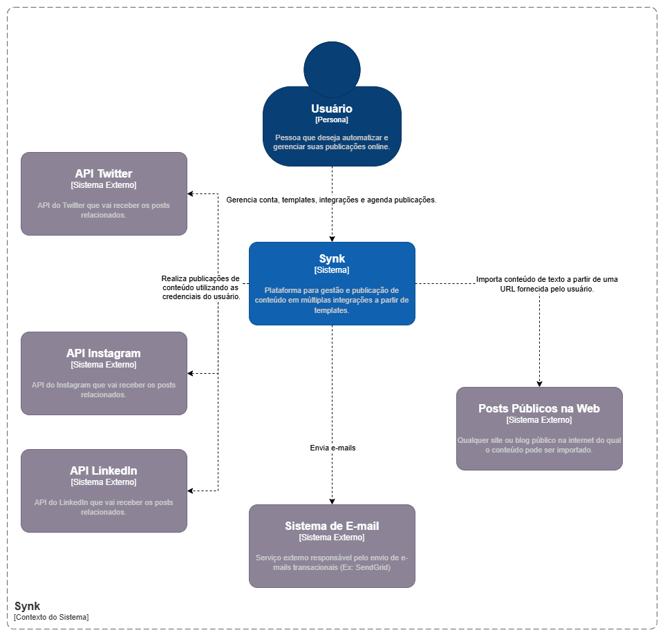
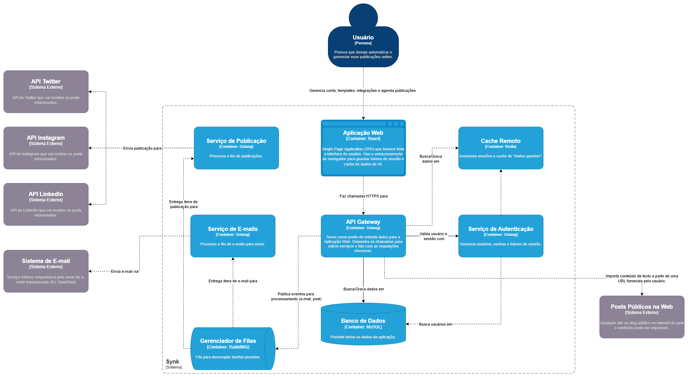
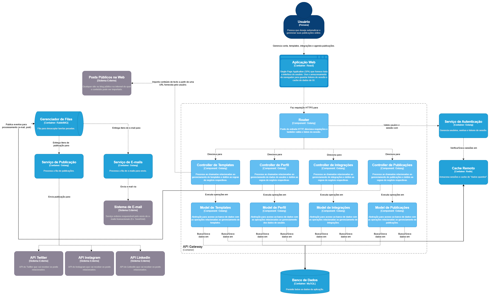
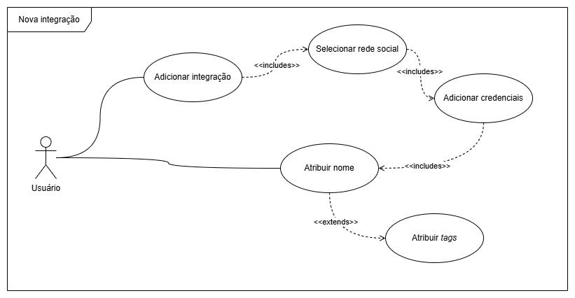
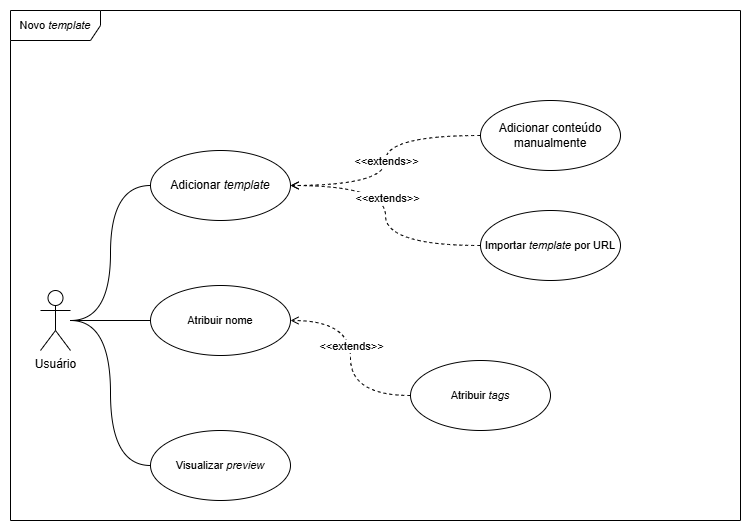

# About

> A practical and simple way to deliver your announcements.

Synk has the objective to achieve final announcement in the quickest way, where you have to invest you energy once, and then next times just choose, update and publish.

This app is a template builder with integration with social medias, to publish same content across plataforms you want, without losing formatting or structure.

# Technologies

- [React](https://react.dev/)
- [Vite](https://vitejs.dev/)
- [Golang](https://go.dev/)
- [Redis](https://redis.io/)
- [RabbitMQ](https://www.rabbitmq.com/)
- [MySQL](https://www.mysql.com/)
- [Google Cloud Platform (GCP)](https://cloud.google.com/)
- [GitHub](https://github.com/)
- [GitHub Actions](https://github.com/features/actions)
- [GitHub Projects](https://github.com/features/project-management)
- [SendGrid](https://sendgrid.com)
- [Google Cloud Balancing](https://cloud.google.com/load-balancing)

# Links

- [Figma Logo](https://www.figma.com/design/AarajzZLJxzLAWo32JJUB4/Logo-Synk?node-id=0-1&t=tXjK6b4N7Rq8ZCr1-1)

# Structure

## C4 models

### C1

### C2

### C3

## Use case diagrams

